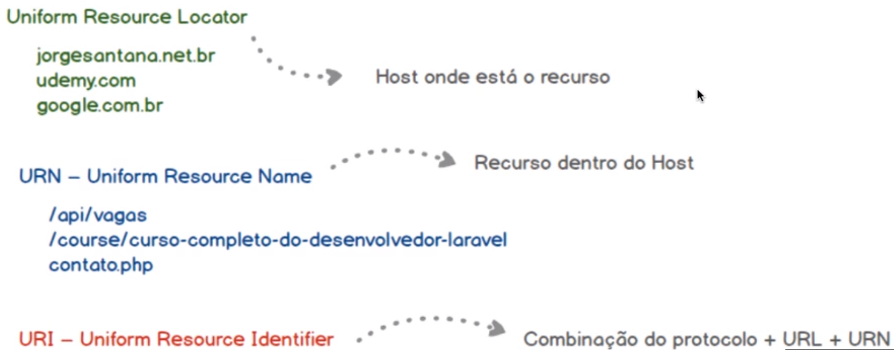

## O que estou apreendendo com esse projeto de Locadora de Carros no Laravel

Trabalhar com rotas, grupos e com os verbos HTTP Get, Post, Delete, Put e Patch.
Trabalhar com o motor de renderização de views Blade
Trabalhar com o desenvolvimento incremental de bancos de dados relacionais utilizando Migrations
Criar Seeders e Factories para popular tabelas
Trabalhar com o console Tinker
Como manipular e validar formulários
Como interceptar requisições e respostas utilizando Middlewares
Como implementar as operações CRUD utilizando o Eloquent ORM
Como implementar autenticação por Session e Token (JWT)
Como lidar com o padrão de arquitetura MVC (Model, View e Controller)
Como exportar arquivos nos formatos XLSX, CSV e PDF
Como enviar e-mails
Construir APIs Webservices REST
Dominar os principais recursos do framework Laravel
Como combinar os frameworks Bootstrap (CSS) e Laravel
Como combinar os frameworks VueJS e Laravel
Como combinar o Laravel com o banco de dados Redis para armazenamento de dados em memória (cache)
Como desenvolver projetos web de forma rápida e estruturada

##  INFORMAÇÕES EXTRAS (PT/BR)
 **Entendendo o conceito de endpoint (URL, URN e URI)**

 

**Fonte: Jorge Santana do curso de laravel*

 

##  TECNOLOGIAS UTILIZADAS NO DESENVOLVIMENTO DO PROJETO

 

 
 
 
 
 

 
